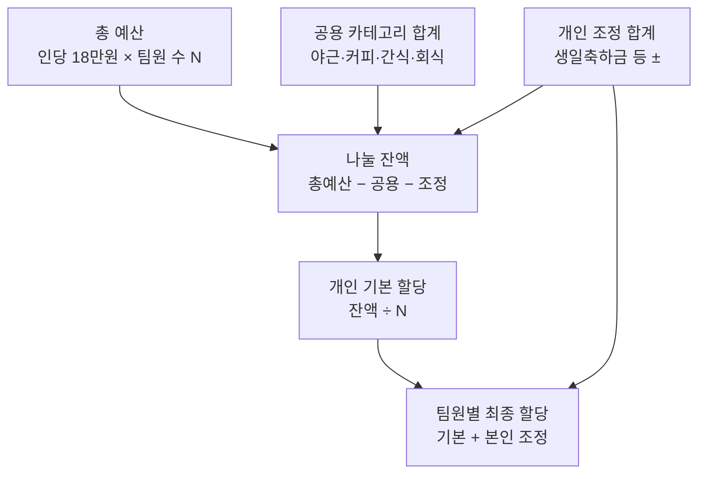

# 팀 부서비 운영 관리 웹앱 — 요구사항·구현 계획 (PRD)
> 팀 공용 부서비(인당 18만 원)를 공정·투명하게 기록·관리하는 내부용 웹앱

**문서 정보** · 작성일 2026-07-01 · v0.3 (착수용) · 대상 독자: 팀장·팀원, 구현 담당(Claude Code) · 근거: 팀 부서비 논의안 및 디자인 스킬(light-console-ui)

> 이 문서는 **Claude Code에 그대로 전달**해 구현을 시작하기 위한 단일 자립형 문서다. 본문(요구사항·설계·태스크)에 더해, **부록 A(디자인 가이드)** 와 **부록 B(design-tokens.css 전문)** 를 포함한다. Claude Code는 부록 B의 CSS를 `design-tokens.css`로 저장하고 부록 A의 규칙에 따라 UI를 구성하면 된다.

---

## 요약

- 조직개편으로 신설된 팀의 **부서비(인당 18만 원 × 팀원 수)** 를 기록·배분·조회하는 내부 웹앱. 팀원 수는 **가변**(현재 7명, 증감 가능) → 총 예산은 인원에 따라 자동 변동.
- 핵심 로직은 단순: **공용 카테고리 금액을 설정하면, 남은 돈이 개인 몫으로 자동 배분**된다. 공용을 늘리면 개인 할당이 줄고, 줄이면 늘어난다 — 이것이 "가중치 조절"의 실체.
- **생일축하금은 공용 풀이 아니라 개인 조정(±) 라인**으로 처리. 설정에서 팀원별로 얼마든지 더하고 뺄 수 있는 일반 조정 항목으로 구현.
- 지출은 **공용 지출(카테고리 풀 차감)** 과 **개인 지출(특정 팀원 할당 차감)** 두 종류뿐. 단일 공유 계정으로 로그인하므로 개인 지출은 **대상 팀원을 직접 선택**해 기록.
- 한도는 **월 단위**로 운영. **매월 1일 새 한도로 리셋되며 미사용액은 이월 없이 소멸**. 모든 지출·집계는 해당 월(기간)에 귀속.
- 기술 구성은 **외부 SaaS 의존 없이** Linux VM 위 **docker-compose** 단일 스택으로 자체 호스팅. 실제 구현은 **Claude Code**로 진행.

---

## 1. 배경 및 목적

### 1.1 배경

- 조직개편으로 팀 신설, 팀원 1인당 월 **18만 원**의 부서비 부여. 현재 7명 기준 총 **126만 원**(인원 증감 시 변동).
- 법인카드 **2장**을 팀원이 공용 사용. 카드 사용 문자는 지정된 **담당 2명**에게만 발송됨.
- 나머지 팀원은 본인 사용액을 **할당 범위 내에서 쓰고, 기록할 책임**을 짐.
- 커피·간식 위주였던 초기안을 회식·생일축하 쪽으로 조정하기로 함. 각 항목 **금액(가중치)은 언제든 변경 가능**해야 함.
- 운영 안정화 후 팀장 제외 팀원이 **돌아가며 담당**, 담당자에게 소정의 **Benefit** 부여도 검토 대상.

### 1.2 목적 · 범위

- **목적**: 팀원이 부서비 사용을 쉽게 기록하고, 남은 예산을 카테고리별·개인별로 한눈에 확인하도록 함.
- **범위 안(In)**: 로그인, 설정(카테고리·팀원·개인 조정), 예산 자동 배분, 지출 입력, 대시보드(잔액), 내역 조회·수정.
- **범위 밖(Out, v1 기준)**:
  - 카드 사용 **문자 자동 파싱·연동** — v1은 수동 입력만.
  - 다중 사용자 계정·권한 체계 — 단일 공유 계정만.
  - 외부 회계/전표 시스템 연동, 영수증 이미지 OCR.
  - 담당자 로테이션·Benefit **자동화** — 개념만 반영, 정식 기능은 추후.
  - 월 중 입·퇴사자 **일할 비례배분(proration)** — v1은 현재 인원 기준 단순 재계산.

---

## 2. 핵심 도메인 모델 (예산 계산 로직)

이 앱에서 헷갈리기 쉬운 지점을 먼저 못 박는다. **개인 할당은 설정값이 아니라 "잔여값"** 이라는 점이 핵심.

### 2.1 두 종류의 지출

- **공용 지출**: 해당 **카테고리 풀**에서 차감. 누가 썼는지는 몰라도 됨. 예) 주간회의 커피, 팀 간식, 야근 식대, 회식.
- **개인 지출**: 특정 **팀원의 개인 할당**에서 차감. 누구 것인지 반드시 지정.

### 2.2 개인 할당 산식

- 총 예산 = **인당 금액(180,000) × 팀원 수(N)**. N은 가변.
- 개인 기본 할당 = (**총 예산 − 공용 카테고리 합계 − 개인 조정 합계**) ÷ N.
- 팀원별 최종 할당 = **개인 기본 할당 + 본인 조정액**.
- 이 구조 덕분에 어떤 설정·인원 조합에서도 **합계는 항상 총 예산에 정확히 맞음**. 즉 돈이 새거나 남지 않음.


* 자료: 자체 작성

### 2.3 개인 조정 — 생일축하금 등

- 생일축하금은 **공용 카테고리가 아니라 팀원에게 붙는 개인 보너스**로 재정의.
- 설정에서 **팀원별 조정 라인**을 자유롭게 추가·수정·삭제. 금액은 **+/− 모두 허용**(보너스뿐 아니라 차감도 가능).
- 조정액은 위 산식에서 **나눌 잔액을 줄이고**, 그만큼 해당 팀원에게 되돌아감 → 팀 전체가 조금씩 나눠 부담하는 구조로 자동 정산.
- 특정 팀원 보너스를 주면서 **다른 팀원 기본 할당을 지키고 싶으면**, 공용 카테고리(예: 간식)를 그만큼 낮추면 됨. "커피/간식에서 충당" 요구가 이 방식으로 유연하게 반영됨.

### 2.4 팀원 증감 정책 (★ 신규)

- 팀원은 **추가·삭제 가능**. 인원(N)이 곧 총 예산과 나눗셈의 분모를 결정 → 팀원 관리가 예산 전체에 직결.
- **월 시작 시점의 인원(N)을 해당 월에 스냅샷**으로 고정 → 과거 월 집계는 인원이 바뀌어도 불변.
- **열려 있는 당월**에 팀원이 증감하면, 당월 인원·총예산·개인 할당을 **즉시 재계산**(v1은 일할 비례배분 없이 단순 재분배).
- 이미 특정 팀원 명의로 입력된 개인 지출이 있는 상태에서 그 팀원을 삭제하려 하면 **경고·차단**(데이터 정합성 보호). 필요 시 "비활성(inactive)" 처리로 명단에서만 제외.

### 2.5 기간(월) 정책 — 리셋·소멸

- 회계 단위는 **월(YYYY-MM)**, 범위는 **매월 1일 00:00 ~ 말일 23:59**.
- **매월 1일 한도가 새로 부여**되고, 전월 미사용액은 **이월 없이 소멸**.
- 지출은 입력한 **날짜로 소속 월이 자동 결정**됨. 대시보드는 기간을 선택해 조회(기본: 당월).
- 카테고리 금액·개인 조정·인원은 **월 시작 시점 값으로 스냅샷** 저장 → 이후 설정을 바꿔도 과거 월 집계는 불변. 생일축하금 같은 조정은 **해당 생일 월에만** 적용.

### 2.6 예시 계산 (7명 기준)

| 항목 | 성격 | 예시 금액 | 계산 방식 |
|---|---|---|---|
| 야근 식대 | 공용 풀 | 400,000 | 설정값 − 지출 합 |
| 커피 | 공용 풀 | 210,000 | 설정값 − 지출 합 |
| 간식 | 공용 풀 | 100,000 | 설정값 − 지출 합 |
| 회식 | 공용 풀 | 100,000 | 설정값 − 지출 합 |
| 생일축하금(A팀원) | 개인 조정(+) | 50,000 | 개인 할당에 가산 |
| **개인 기본 할당** | **잔여 자동배분** | **≈57,143 / 인** | (1,260,000 − 810,000 − 50,000) ÷ 7 |

* 자료: 사용자 제공 논의안 기반 예시. 실제 값은 설정에서 자유 조정.
* 검증: 공용 810,000 + (기본 57,143 × 6) + (A: 57,143 + 50,000) = **1,260,000** ✓

---

## 3. 요구사항

### 3.1 기능 요구사항

| ID | 기능 | 설명 | 우선순위 |
|---|---|---|---|
| FR-01 | 로그인 | 단일 공유 비밀번호로 접근 게이트. 성공 시 세션 쿠키 발급 | Must |
| FR-02 | 공용 카테고리 설정 | 카테고리명·금액 추가/수정/삭제 | Must |
| FR-03 | 팀원 관리(증감) | 팀원 추가/수정/삭제. 인원 변동 시 총예산·개인 할당 자동 반영. 지출 있는 팀원 삭제는 경고/비활성 처리 | Must |
| FR-04 | 개인 조정 설정 | 팀원별 ± 조정 라인(생일축하금 등) 자유 편집 | Must |
| FR-05 | 개인 할당 자동 계산 | 산식(2.2) 실시간 반영·표시 | Must |
| FR-06 | 지출 입력 | 날짜·금액·분류(공용/개인)·대상 팀원·카드(1·2)·메모 | Must |
| FR-07 | 대시보드-카테고리 | 카테고리별 배정·사용·잔액, 전체 소진율 | Must |
| FR-08 | 대시보드-팀원 | 팀원별 할당·사용·잔액 표 | Must |
| FR-09 | 내역 조회·수정·삭제 | 지출 내역 목록, 필터, 편집 | Should |
| FR-10 | 카드 기록 | 사용 카드(1·2) 선택·집계 | Should |
| FR-11 | 월 기간 관리·리셋 | 매월 1일 한도 재부여, 미사용액 소멸, 기간별 조회 | Must |
| FR-12 | 변경 이력 로깅 | 지출 수정·삭제 시 이력 기록(시각·대상 내역·변경 전후 값). 단일 계정이라 "누가"는 미식별 | Must |
| FR-13 | 담당자 로테이션·Benefit | 담당자 지정·Benefit 예산 반영 | Won't (v1, TBD) |

* 우선순위: MoSCoW(**M**ust/**S**hould/**C**ould/**W**on't).

### 3.2 비기능 요구사항

| ID | 항목 | 기준 |
|---|---|---|
| NFR-01 | 자체 호스팅 | 외부 SaaS 의존 없이 Linux VM + docker-compose로 기동 |
| NFR-02 | 데이터 영속·백업 | DB를 볼륨에 저장, 파일 복사만으로 백업 가능 |
| NFR-03 | 사용 편의 | 모바일 반응형, 빠른 금액 버튼 등 입력 최소 마찰 |
| NFR-04 | 디자인 일관성 | 부록 A·B **light-console-ui** 토큰·컴포넌트 준수(하드코딩 색 금지) |
| NFR-05 | 최소 보안 | 비밀번호 해시 보관, HTTPS 권장(리버스 프록시) |

---

## 4. 기술 스택 및 구성

원칙: **작게, 의존성 없이, 한 대의 VM에서 compose로.** 소규모 내부 도구에 과설계 지양.

### 4.1 스택

- **프런트엔드**: 정적 **HTML + CSS + 바닐라 JS**. 프레임워크 불필요(규모상 충분). `design-tokens.css` 적용.
- **백엔드**: **Node.js 20 + Express**(단일 서비스, 정적 파일 서빙 + REST API). 대안: Python **FastAPI**.
- **DB**: **SQLite**(파일 1개, 볼륨 마운트). 별도 DB 컨테이너 불필요 → 가장 단순. 대안: **PostgreSQL** 컨테이너(규모 커질 때).
- **인증**: 공유 비밀번호를 **환경변수에 해시(bcrypt)** 로 보관 → 검증 후 **서명된 httpOnly 쿠키(JWT)** 발급.
- **리버스 프록시(선택)**: **Caddy** — 도메인만 있으면 HTTPS 자동. 없으면 생략 가능.
- **구현 도구**: **Claude Code**로 스캐폴딩부터 배포 스크립트까지 진행.

> **왜 SQLite인가**: 프레임워크가 골조까지 지어진 집이라면, SQLite는 "가구가 딸린 원룸" — 서버·계정·네트워크 설정 없이 파일 하나가 곧 DB다. 소량 데이터에 운영 부담이 가장 낮다.

### 4.2 배포 구성 (docker-compose)

```yaml
services:
  app:
    build: .
    ports: ["8080:8080"]
    environment:
      - APP_PASSWORD_HASH=${APP_PASSWORD_HASH}   # bcrypt 해시
      - JWT_SECRET=${JWT_SECRET}
    volumes:
      - data:/app/data                            # SQLite 파일 영속
    restart: unless-stopped

  # (선택) 도메인 HTTPS가 필요할 때만
  caddy:
    image: caddy:2
    ports: ["80:80", "443:443"]
    volumes:
      - ./Caddyfile:/etc/caddy/Caddyfile
      - caddy_data:/data
    depends_on: [app]
    restart: unless-stopped

volumes:
  data:
  caddy_data:
```
* Linux VM에서 `docker compose up -d` 한 번으로 기동. 백업은 `data` 볼륨 복사.

### 4.3 데이터 모델

- **settings**: `per_person`(180000).
- **members**: `id`, `name`, `birthday`(nullable), `active`(bool) — 월과 무관하게 유지되는 팀원 명단. 삭제 대신 `active=false`로 비활성 가능(FR-03).
- **category_templates**: `id`, `name`, `default_amount` — 매월 시드에 쓰는 기본 카테고리(야근/커피/간식/회식).
- **period_meta**: `period`(YYYY-MM), `member_count` — 월 시작 시점 인원 스냅샷(2.4).
- **period_categories**: `id`, `period`(YYYY-MM), `name`, `amount` — 해당 월의 공용 카테고리 스냅샷.
- **adjustments**: `id`, `period`(YYYY-MM), `member_id`, `label`(예: 생일축하금), `amount`(±) — 그 월의 개인 조정.
- **transactions**: `id`, `date`, `period`(날짜에서 파생), `amount`, `kind`(`common`|`personal`), `period_category_id`(공용일 때), `member_id`(개인일 때), `card`(1|2), `memo`, `created_at`.
- **audit_logs**: `id`, `at`, `action`(`update`|`delete`), `target`(테이블·행 id), `before`(JSON), `after`(JSON) — FR-12 변경 이력.

### 4.4 API 개요

- 조회·집계 API는 공통으로 `?period=YYYY-MM` 파라미터를 받음(기본: 당월).
- `POST /api/login` — 비밀번호 검증, 쿠키 발급.
- `GET/PUT /api/settings` — 인당 금액.
- `GET/POST/PUT/DELETE /api/category-templates` — 매월 시드용 기본 카테고리.
- `GET/PUT /api/periods/:period/categories` — 해당 월 카테고리 금액(스냅샷) 조회·수정.
- `GET/POST/PUT/DELETE /api/members` — 팀원 증감. 삭제 시 지출 존재 검사 → 경고/비활성.
- `GET/POST/PUT/DELETE /api/adjustments?period=` — 개인 조정(월별).
- `GET/POST/PUT/DELETE /api/transactions?period=` — 지출. 수정·삭제 시 `audit_logs` 자동 기록.
- `GET /api/dashboard?period=` — 카테고리·팀원 잔액 집계(산식 2.2 서버 계산).
- **월 시드**: 매월 1일 최초 접근(또는 스케줄) 시 `category_templates`·현재 인원 → `period_categories`·`period_meta` 자동 생성.

---

## 5. 태스크 (구현 순서)

Claude Code로 아래 순서 진행. 각 태스크는 화면 + API + 저장을 한 단위로.

1. **스캐폴딩** — 저장소, `docker-compose.yml`, Express 서버, SQLite 스키마 초기화(기간·감사로그 테이블 포함), 부록 B의 `design-tokens.css` 적용한 기본 레이아웃(`.app-header`/`.wrap`/`.panel`).
2. **로그인 게이트(FR-01)** — 공유 비밀번호 검증, 쿠키 세션, 미인증 리다이렉트.
3. **기간·시드 로직(FR-11)** — 당월 판별, 월 1일 `category_templates`·인원 → `period_categories`·`period_meta` 시드, 초기값(야근 400k/커피 210k/간식 100k/회식 100k). 기간 선택 UI.
4. **팀원·설정 화면·API(FR-02·03·04)** — 팀원 증감(비활성 포함), 카테고리 템플릿·월 금액, 개인 조정 CRUD. 폼은 `.input`/`.btn`/`.modal` 사용.
5. **예산 계산 로직(FR-05)** — 서버 공용 계산 함수(당월·현재 인원 기준) + 설정 화면 실시간 미리보기(공용·인원 변경 시 개인 할당 즉시 재계산).
6. **지출 입력 화면·API(FR-06·10)** — 분류·대상 팀원·카드·메모, 빠른 금액 버튼. 개인 선택 시에만 팀원 드롭다운 노출. 날짜→기간 자동 귀속.
7. **대시보드(FR-07·08)** — 당월 카테고리 잔액 카드(`.card` + `.badge`), 팀원별 잔액 `table.data`, 전체 소진율.
8. **내역 조회·수정·삭제 + 감사로그(FR-09·12)** — 목록·필터·편집, 수정·삭제 시 `audit_logs` 기록.
9. **배포** — VM에 compose 배포, 볼륨 백업 절차 문서화, (선택) Caddy HTTPS.
10. **(추후·TBD) 확장(FR-13)** — 담당자 로테이션·Benefit 반영.

---

## 6. 확정된 운영 정책

착수 기준으로 아래 정책이 확정됨.

| 항목 | 결정 |
|---|---|
| 정산 주기 | **매월 1일~말일**. 매월 1일 한도 재부여, **미사용액 이월 없이 소멸** |
| 팀원 증감 | **가능**. 인원이 총예산·분모를 결정, 당월 즉시 재계산(비례배분 없음). 지출 있는 팀원은 비활성 처리 |
| 설정 변경 권한 | **전원 편집 허용**(v1, 관리자 핀 미도입) |
| 지출 수정·삭제 | **누구나 가능**, 변경 이력은 **감사 로그로 기록**(FR-12) |
| 초기 카테고리 기본값 | 야근 400,000 / 커피 210,000 / 간식 100,000 / 회식 100,000 시드 |
| 담당자 Benefit | **TBD** — v1 제외, 추후 검토(FR-13) |

---

## 부록 A. 디자인 가이드 (light-console-ui)

대시보드/콘솔/관리 UI를 위한 **밝고 미니멀한** 디자인 시스템. Inter 폰트 + 블루 액센트(#0053db), 흰 카드 + 은은한 그림자, 충분한 여백. 이 웹앱의 모든 화면을 이 톤으로 맞춘다.

### A.1 빠른 적용 (3단계)

- **Inter 폰트 로드** (`<head>`):
  ```html
  <link rel="preconnect" href="https://fonts.googleapis.com">
  <link href="https://fonts.googleapis.com/css2?family=Inter:wght@400;500;600;700&display=swap" rel="stylesheet">
  ```
- **`design-tokens.css` 적용** — 부록 B의 CSS를 프로젝트에 `design-tokens.css`로 저장하고 로드. `:root` 토큰 블록 + 필요한 컴포넌트 클래스를 그대로 사용.
- **시맨틱 클래스로 마크업** — 아래 컴포넌트 패턴을 사용. 색은 항상 토큰(`var(--…)`)으로, **하드코딩 hex 금지**.

### A.2 디자인 토큰 (요약)

| 그룹 | 토큰 | 값 |
|---|---|---|
| 배경 | `--bg` / `--panel` / `--panel-2` | `#f8f9fb` / `#ffffff` / `#f1f4f7` |
| 테두리 | `--border` / `--border-soft` | `#e2e9ee` / `#eaeef2` |
| 텍스트 | `--text` / `--muted` / `--faint` | `#2b3438` / `#586065` / `#abb3b9` |
| 액센트 | `--accent` / `--accent-hover` / `--accent-soft` | `#0053db` / `#0048bf` / `#dbe1ff` |
| 상태 | `--ok` / `--warn` / `--danger` | `#0a7d33` / `#b25e00` / `#c62828` |
| 라운드 | `--radius-sm/--radius/--radius-lg/--radius-xl` | 6 / 10 / 12 / 14 px |
| 그림자 | `--shadow-card` / `--shadow-pop` | `0 1px 2px rgba(16,24,40,.05)` / `0 12px 40px rgba(16,24,40,.18)` |
| 폰트 | `--font-sans` / `--font-mono` | Inter / ui-monospace |

### A.3 컴포넌트 패턴

- **레이아웃**: `.app-header`(흰 배경 + 하단 보더) → `.wrap`(max-width 1180px, 중앙) → `.panel`/`.card`.
- **카드/패널**: `.panel`(흰 배경 + 1px 보더 + `--shadow-card`, radius 12). 제목은 `.panel h2`(작은 대문자 회색), 소제목은 `.section-label`.
- **버튼**: `.btn`(기본), `.btn-primary`(블루 채움+흰 글자), `.btn-danger`(빨강 보더/텍스트).
- **칩/배지**: `.chip`(소프트 블루), `.chip-muted`(회색), `.badge-ok/-warn/-danger`(상태색 12% 배경). 예산 소진 상태 표시에 활용.
- **상태 점**: `.dot` + `.ok`/`.live`(액센트 + 링)/`.err`.
- **탭**: `.tabs` > `.tab-btn`(`.active`는 액센트 + 하단 보더). 대시보드/설정/내역 전환에 활용.
- **입력**: `.input`/`input`/`textarea`(포커스 시 액센트 보더 + 소프트 링).
- **코드블록**: `pre.code`(`--panel-2` 배경 + 모노폰트).
- **테이블**: `table.data`(대문자 회색 헤더, 행 hover 시 `--panel-2`). 팀원별 잔액·지출 내역에 활용.
- **모달**: `.modal-overlay` > `.modal`(radius 14 + `--shadow-pop`) > `.modal-head`/`.modal-body`. 입력·편집 폼에 활용. (`.modal-overlay[hidden]` 가드 유지 필수 — 아래 주의 참고.)
- **푸터**: `footer`(상단 보더 + 중앙 정렬 + muted small).

### A.4 원칙

- **라이트·미니멀·여백**. 흰 카드 + 은은한 그림자, 과한 테두리/그림자 금지.
- **블루 단일 액센트**(#0053db). 상태는 ok/warn/danger 세 가지로 절제.
- **Inter** 본문, 코드/식별자만 모노. 숫자 열(금액·잔액)은 `font-variant-numeric: tabular-nums`.
- **색은 토큰으로만**. 새 색이 필요하면 토큰을 추가하고 그 토큰을 쓴다(인라인 hex 금지).
- **사용자 노출 문구는 친절하게** — 상태는 명확한 배지(연결됨/소진/초과 등)로.
- **반응형**: 2단 그리드는 좁은 화면에서 1단으로(`@media (max-width: 900px)`), 모달/표는 가로 스크롤 허용.
- 다크 테마가 필요하면 `:root` 토큰만 다크값으로 오버라이드(컴포넌트 클래스는 그대로 재사용).

### A.5 구현 주의

- 모달 숨김 처리 시 `.modal-overlay[hidden] { display: none; }` 가드를 반드시 유지한다. `display` 계열 클래스가 `[hidden]`의 기본 `display:none`을 덮어써 숨겨야 할 모달이 보이는 버그를 막기 위함이다.

---

## 부록 B. design-tokens.css (전문)

아래 내용을 프로젝트 루트(또는 `public/`)에 **`design-tokens.css`** 로 저장해 사용한다.

```css
/* ============================================================================
   Light Console UI — design tokens + base component library
   Clean, minimal, light dashboard/console aesthetic. Inter + blue accent.
   Copy this file (or inline the :root block + the components you need).
   Load Inter:
   <link rel="preconnect" href="https://fonts.googleapis.com">
   <link href="https://fonts.googleapis.com/css2?family=Inter:wght@400;500;600;700&display=swap" rel="stylesheet">
   ========================================================================== */

:root {
  /* surfaces */
  --bg: #f8f9fb;          /* page background */
  --panel: #ffffff;       /* cards / panels */
  --panel-2: #f1f4f7;     /* secondary surface, code blocks, chips base */
  --border: #e2e9ee;      /* default border */
  --border-soft: #eaeef2; /* lighter divider */

  /* text */
  --text: #2b3438;        /* primary text */
  --muted: #586065;       /* secondary text */
  --faint: #abb3b9;       /* tertiary / placeholders / inactive dots */

  /* accent (blue) */
  --accent: #0053db;
  --accent-hover: #0048bf;
  --accent-soft: #dbe1ff; /* soft accent background (chips/badges) */

  /* status (light-tuned, accessible on white) */
  --ok: #0a7d33;
  --warn: #b25e00;
  --danger: #c62828;

  /* shape */
  --radius-sm: 6px;
  --radius: 10px;
  --radius-lg: 12px;
  --radius-xl: 14px;

  /* elevation */
  --shadow-card: 0 1px 2px rgba(16, 24, 40, 0.05);
  --shadow-pop: 0 12px 40px rgba(16, 24, 40, 0.18);

  --font-sans: "Inter", system-ui, -apple-system, BlinkMacSystemFont, "Segoe UI", sans-serif;
  --font-mono: ui-monospace, SFMono-Regular, Menlo, Monaco, Consolas, "Liberation Mono", monospace;
}

* { box-sizing: border-box; }

body {
  margin: 0;
  background: var(--bg);
  color: var(--text);
  font-family: var(--font-sans);
  line-height: 1.5;
  -webkit-font-smoothing: antialiased;
}

/* ---- layout -------------------------------------------------------------- */
.app-header {
  display: flex; align-items: center; gap: 0.8rem;
  padding: 1.1rem 1.6rem; border-bottom: 1px solid var(--border);
  background: var(--panel);
}
.app-header h1 { font-size: 1.15rem; font-weight: 650; margin: 0; }
.app-header .sub { color: var(--muted); font-size: 0.82rem; }

.wrap { max-width: 1180px; margin: 0 auto; padding: 1.4rem 1.6rem 3rem; }

/* ---- panel / card -------------------------------------------------------- */
.panel, .card {
  background: var(--panel);
  border: 1px solid var(--border);
  border-radius: var(--radius-lg);
  box-shadow: var(--shadow-card);
}
.panel { padding: 1.1rem 1.2rem; }
.panel h2 {
  font-size: 0.82rem; text-transform: uppercase; letter-spacing: 0.06em;
  color: var(--muted); font-weight: 600; margin: 0 0 0.9rem;
}
.section-label {
  font-size: 0.74rem; text-transform: uppercase; letter-spacing: 0.05em;
  color: var(--muted); font-weight: 600; margin-bottom: 0.45rem;
}

/* ---- buttons ------------------------------------------------------------- */
.btn {
  appearance: none; border: 1px solid var(--border); background: var(--panel);
  color: var(--text); border-radius: var(--radius); padding: 0.55rem 0.9rem;
  font: inherit; font-weight: 600; font-size: 0.86rem; cursor: pointer;
  transition: background 0.15s, border-color 0.15s, opacity 0.15s;
}
.btn:hover { border-color: var(--accent); }
.btn-primary { background: var(--accent); color: #fff; border-color: var(--accent); }
.btn-primary:hover { background: var(--accent-hover); }
.btn-danger { color: var(--danger); border-color: rgba(198, 40, 40, 0.35); }
.btn-danger:hover { background: rgba(198, 40, 40, 0.08); }
.btn:disabled { opacity: 0.5; cursor: not-allowed; }

/* ---- chips / badges ------------------------------------------------------ */
.chip {
  display: inline-flex; align-items: center; gap: 0.3rem;
  font-size: 0.7rem; font-weight: 600; padding: 0.14rem 0.5rem;
  border-radius: var(--radius-sm); background: var(--accent-soft); color: var(--accent);
}
.chip-muted { background: var(--panel-2); color: var(--muted); }
.badge { font-size: 0.72rem; font-weight: 600; padding: 0.18rem 0.55rem; border-radius: 999px; }
.badge-ok { background: rgba(10, 125, 51, 0.12); color: var(--ok); }
.badge-warn { background: rgba(178, 94, 0, 0.12); color: var(--warn); }
.badge-danger { background: rgba(198, 40, 40, 0.12); color: var(--danger); }

/* status dot */
.dot { width: 9px; height: 9px; border-radius: 50%; background: var(--faint); display: inline-block; }
.dot.ok { background: var(--ok); }
.dot.live { background: var(--accent); box-shadow: 0 0 0 4px rgba(0, 83, 219, 0.14); }
.dot.err { background: var(--danger); }

/* ---- tabs ---------------------------------------------------------------- */
.tabs { display: flex; gap: 0.3rem; }
.tab-btn {
  border: none; background: none; color: var(--muted); font: inherit;
  font-weight: 600; font-size: 0.86rem; padding: 0.5rem 0.8rem; cursor: pointer;
  border-radius: var(--radius-sm); border-bottom: 2px solid transparent;
}
.tab-btn:hover { color: var(--text); }
.tab-btn.active { color: var(--accent); border-bottom-color: var(--accent); }

/* ---- inputs -------------------------------------------------------------- */
.input, input[type="text"], textarea, select {
  width: 100%; font: inherit; color: var(--text);
  background: var(--panel); border: 1px solid var(--border);
  border-radius: var(--radius); padding: 0.55rem 0.7rem;
}
.input:focus, input[type="text"]:focus, textarea:focus {
  outline: none; border-color: var(--accent); box-shadow: 0 0 0 3px rgba(0, 83, 219, 0.12);
}

/* ---- code block ---------------------------------------------------------- */
.code, pre.code {
  background: var(--panel-2); border: 1px solid var(--border); border-radius: var(--radius);
  padding: 0.7rem; font-family: var(--font-mono); font-size: 0.74rem; color: var(--text);
  white-space: pre-wrap; word-break: break-word; overflow: auto;
}

/* ---- table --------------------------------------------------------------- */
table.data { width: 100%; border-collapse: collapse; font-size: 0.85rem; }
table.data th {
  text-align: left; font-size: 0.72rem; text-transform: uppercase; letter-spacing: 0.04em;
  color: var(--muted); font-weight: 600; padding: 0.5rem 0.6rem; border-bottom: 1px solid var(--border);
}
table.data td { padding: 0.55rem 0.6rem; border-bottom: 1px solid var(--border-soft); }
table.data tr:hover td { background: var(--panel-2); }

/* ---- modal --------------------------------------------------------------- */
.modal-overlay {
  position: fixed; inset: 0; z-index: 50; padding: 1.2rem;
  background: rgba(16, 24, 40, 0.42);
  display: flex; align-items: center; justify-content: center;
}
/* IMPORTANT: a class `display` overrides the [hidden] attribute's UA display:none,
   so the modal would show even when hidden. Keep this guard. */
.modal-overlay[hidden] { display: none; }
.modal {
  width: min(680px, 100%); max-height: 86vh; overflow: auto;
  background: var(--panel); border: 1px solid var(--border);
  border-radius: var(--radius-xl); box-shadow: var(--shadow-pop);
}
.modal-head {
  display: flex; align-items: center; justify-content: space-between;
  padding: 1rem 1.2rem; border-bottom: 1px solid var(--border);
}
.modal-title { font-weight: 650; }
.modal-close {
  width: 30px; height: 30px; border: 1px solid var(--border); background: var(--panel-2);
  border-radius: var(--radius-sm); color: var(--muted); cursor: pointer;
}
.modal-close:hover { color: var(--text); border-color: var(--accent); }
.modal-body { padding: 1.1rem 1.2rem; }

/* ---- misc ---------------------------------------------------------------- */
.muted { color: var(--muted); }
.hint { font-size: 0.74rem; color: var(--muted); }
.empty { color: var(--muted); font-size: 0.86rem; padding: 0.6rem 0; }
footer {
  max-width: 1180px; margin: 0 auto; padding: 1rem 1.6rem 2.2rem;
  border-top: 1px solid var(--border); text-align: center;
  color: var(--muted); font-size: 0.74rem;
}
```

---

## 근거 자료

1. 팀 내부 부서비 운영 논의안(메모·의견 취합), 2026 — 본 문서의 예산·규칙 전제.
2. light-console-ui 디자인 스킬 및 `design-tokens.css` — 부록 A·B로 본 문서에 포함.
